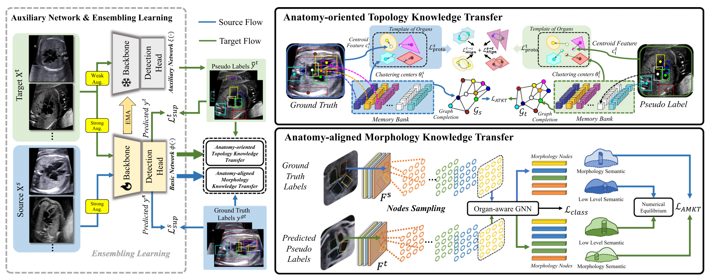
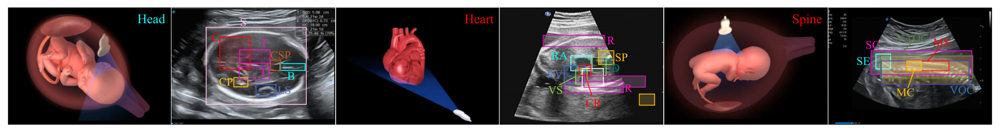

# ToMo-UDA++ (IJCV 2025)

**ToMo-UDA++: Unsupervised Domain Adaptation for Anatomical Structure Detection Using Enhanced Topology and Morphology Knowledge**

<p align="center">
  
  <br>
  <em>Figure 1: Overall framework of ToMo-UDA++.</em>
</p>

<p align="center">
  
  <br>
  <em>Figure 2: Overview of the FUSSD<sup>3</sup> dataset.</em>
</p>

---

## 📋 Overview

ToMo-UDA++ is a PyTorch-based implementation for unsupervised domain adaptation in anatomical structure detection, leveraging enhanced topology and morphology knowledge. The method achieves robust cross-device generalization for medical ultrasound image analysis.

### Key Features
- ✅ Topology-aware feature alignment for structural consistency
- ✅ Morphology-guided knowledge distillation across domains
- ✅ Plug-and-play modules compatible with Detectron2-based detectors
- ✅ Support for multi-device cross-domain adaptation (Samsung/Philips/GE)

---

## 🛠️ Installation

### Prerequisites
- Python ≥ 3.6
- PyTorch ≥ 1.5 + matching torchvision
- Detectron2 == 0.5
- CUDA ≥ 11.7 (tested on RTX 3090)

### Setup Virtual Environment
```bash
# Create and activate virtual environment
python3 -m venv tomo_env
source tomo_env/bin/activate  # Linux/macOS
# tomo_env\Scripts\activate  # Windows

# Install PyTorch (choose appropriate version for your CUDA)
pip3 install torch torchvision torchaudio --index-url https://download.pytorch.org/whl/cu117

# Install Detectron2 from source
python -m pip install 'git+https://github.com/facebookresearch/detectron2.git@v0.5'
```

### Install Project Dependencies
```bash
pip install -r requirements.txt
```

---

## 📦 Dataset Preparation

### Supported Datasets
| Dataset | Link | Domain Shift | Structures |
|---------|------|-------------|------------|
| **FUSSD³** (Ours) | [Google Drive](https://drive.google.com/drive/folders/1pZ-B_Tnu2qnuYZKO1XDHG9dGe8BGyVX7?usp=drive_link) | Samsung ↔ Philips ↔ GE | 6 anatomical regions |
| **CardiacUDA** | [GitHub](https://github.com/xmed-lab/GraphEcho) | Cross-center echocardiography | Cardiac structures |
| **FUSH** | [GitHub](https://github.com/xmed-lab/ToMo-UDA) | Cross-device fetal ultrasound | Fetal anatomy |

### FUSSD³ Dataset Statistics
| Property | Value |
|----------|-------|
| Annotated Images | 4,654 |
| Resolution | 480–1080p |
| Imaging Views | Sagittal plane |
| Devices | Samsung (1,882), Philips (1,510), GE (1,262) |

### Anatomical Structures (Abbreviations)
| Structure | Abbreviation |
|-----------|-------------|
| Skin Contour | SC |
| Vertebral Arch Ossification Center | VAO |
| Medulla Spinalis | MS |
| Medullary Cone | MC |
| Vertebral Ossification Center | VOC |
| Spinal End | SE |

### COCO Format Organization
Please organize your dataset following the COCO annotation format:
```
datasets/
└── fussd3/
    ├── images/
    │   ├── train/
    │   └── val/
    └── annotations/
        ├── train_sa.json
        ├── val_ge.json
        └── ...
```

---

## 🚀 Training

### Single-Source to Single-Target (e.g., Samsung → GE)
```bash
python train_net.py \
    --num-gpus 1 \
    --config-file configs/frcnn_res50fpn_spine_sa_ge.yaml \
    OUTPUT_DIR output/fussd_sa_ge
```

### Multi-GPU Training
```bash
python train_net.py \
    --num-gpus 4 \
    --config-file configs/frcnn_res50fpn_spine_sa_ge.yaml \
    SOLVER.IMS_PER_BATCH 8 \
    OUTPUT_DIR output/fussd_sa_ge_multigpu
```

### Resume Training
```bash
python train_net.py \
    --resume \
    --num-gpus 1 \
    --config-file configs/frcnn_res50fpn_spine_sa_ge.yaml \
    MODEL.WEIGHTS output/fussd_sa_ge/model_final.pth
```

---

## 📊 Evaluation

### Download Pre-trained Checkpoints
Pre-trained weights are available at: [Google Drive](https://drive.google.com/drive/folders/1pZ-B_Tnu2qnuYZKO1XDHG9dGe8BGyVX7?usp=drive_link)

### Run Evaluation
```bash
python train_net.py \
    --eval-only \
    --num-gpus 1 \
    --config-file configs/test_res.yaml \
    MODEL.WEIGHTS path/to/checkpoint.pth
```

### Expected Results (FUSSD³, SA→GE)
| Method | mAP (%) | SC | VAO | MS | MC | VOC | SE |
|--------|---------|----|-----|----|----|-----|----|
| Source Only |  80.23±4.26  | 99.80 ±1.23 | 85.36±7.89 |  74.46±2.34 |  35.71±12.56 |  93.44±5.12 |  92.62±3.89 |
| ToMo-UDA++ (Ours) | **94.21±5.17** | **100.0±0.00** | **94.68±9.34** | **78.60±13.89** | **98.44±6.16** | **98.65±8.34** | **94.21±5.17** |

---

## 📁 Project Structure
```
ToMo-UDA++/
├── configs/                 # Configuration files
├── datasets/                # Dataset loaders and preprocessing
├── modeling/                # Network architectures and losses
│   ├── topology_module/     # Topology-aware alignment
│   └── morphology_module/   # Morphology-guided distillation
├── tools/                   # Utility scripts
├── train_net.py             # Main training entry point
├── requirements.txt         # Python dependencies
└── README.md                # This file
```

---

## 🤝 Contributing

We welcome contributions! Please:
1. Fork the repository
2. Create a feature branch (`git checkout -b feature/amazing-feature`)
3. Commit your changes (`git commit -m 'Add amazing feature'`)
4. Push to the branch (`git push origin feature/amazing-feature`)
5. Open a Pull Request

---

## 📜 License

This project is licensed under the **MIT License** for academic and research purposes. For commercial use, please contact the authors.

---

## 🙏 Acknowledgements

- This work was supported by [Funding Agencies].
- We thank the contributors of [Detectron2](https://github.com/facebookresearch/detectron2), [PyTorch](https://pytorch.org/), and the medical imaging community.
- Special thanks to the clinical collaborators for dataset curation and annotation.

---

## 📬 Contact

For questions, bug reports, or collaboration inquiries: lvxg@hnu.edu.cn

---

### ✨ Quick Start Checklist
- [ ] Clone repository & install dependencies
- [ ] Download and organize FUSSD³ dataset in COCO format
- [ ] Verify CUDA environment: `python -c "import torch; print(torch.cuda.is_available())"`
- [ ] Run training: `bash scripts/train_sa2ge.sh`
- [ ] Evaluate with pretrained weights
- [ ] Cite our paper if you use this code in your research 🎓

---

## 📄 Publication

This work has been accepted to the **International Journal of Computer Vision (IJCV)**.

> **Citation (BibTeX):**
> ```bibtex
> @article{pu2026tomo,
>  title={ToMo-UDA++: Unsupervised Domain Adaptation for Anatomical Structure Detection Using Enhanced Topology and Morphology Knowledge},
>  author={Pu, Bin and Yang, Jiewen and Lv, Xingguo and Dong, Xingbo and Zhao, Lei and Li, Shengli and Li, Kenli and Li, Xiaomeng},
>  journal={International Journal of Computer Vision},
>  volume={134},
>  number={5},
>  pages={230},
>  year={2026},
>  publisher={Springer}
> }
> ```

🔗 **Paper Link**: [Springer](https://link.springer.com/article/10.1007/s11263-025-02682-2) | [DOI](https://doi.org/10.1007/s11263-025-02682-2)


<p align="center">
  <strong>⭐ If you find this work helpful, please give us a star!</strong>
</p>
